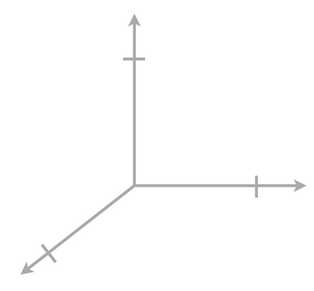
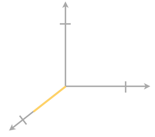
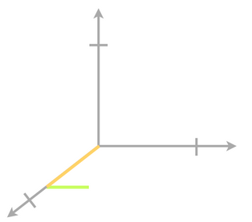
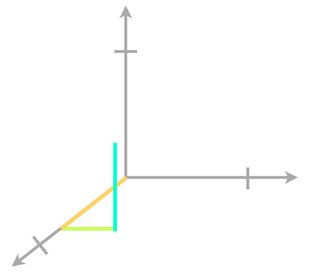
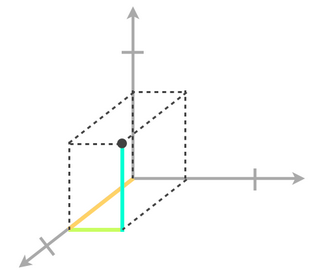

# *Three-dimensional coordinate sytems*
---
In Calculus 1 and 2, we focused only on two dimensional plane. So for the most part all of our equations were defined for $y$ in terms of $x$, and we are able to graph those equations in the $xy$-plane.
These fuctions we called "single variable fuctions".

But now we're transitioning to multivariable fuctions, which are fuctions defined for $z$ in terms of both $x$ and $y$. When we sketch a multivariable fuction, we'll be sketching it in three-dimensional space, instead of the two-dimensional place that we're used to.

in this sections we'll talk about three-dimensional space in general, in comparison to the two-dimensional plane. Let's get started by learning how to plot points, and how to describe a region in 3D.

As we move forward, try to consider how what we know about 3D space is really just an extension of what we already know about 2D space.

# *Plotting points*
---
To plot points in three-dimensional coordinate space, we'll start with a three-dimensional coordinate system, where the $x$-axis comes toward us on the left, the $y$-axis moves out toward the right, and the $z$-axis is perfectly vertical.

If we need to consider negative values of $x$, $y$ or $z$, the we should know that the negative direction of the $x$-axis follows the straight line of the positives $x$-axis away from us, that the negative direction of the $y$-axis moves out to the left, and that the negative direction of the $z$-axis is perfectly vertical, extending out below the positive direction of the $z$-axis

In the same way that we plot points in two-dimensional coordinate space by moving out along the $x$-axis to our $x$ value, and the moving parallel to the $y$-axis until we find our point, in three-dimensional space we'll move along the $x$-axis, the parallel to the $y$-axis, then parallel to the $z$-axis until we arrive at our coordinate point.

---
**Example**

Plot the point in a three-dimensional coordinate system.

    (4,2,3)

We'll start by drawing our axes, the moving out from the origin along the $x$-axis until we get to $x$ = 4.

To get to (4,2) in the $xy$-plane, we'll start where we left off on the $x$-axis, and move parallel to the $y$-axis until we get to y = 2.

To get to (4,2,3) in three-dimensional space, we'll start where we left off in the $xy$-coordinate plane, and move parallel to the $z$-axis until we get to $z$ = 3

If we only plot the point, and nothing else, it can be difficult or impossible to identify the location of a three-dimensional point on a two-dimensional piece of a paper. To fix this problem, we can fill in the three-dimensional box, putting one corner of the box at the origin, and the opposite corner at the coordinate point we just plotted.

  

Even though it's only technically necessary to plot and label coordinate point, you can see how drawing in the lines we used to get to the point, and the box that connects the origin to the coordinate point, is really helpful in giving us some perspective.

# *Distance between points in three dimensions*
---
Given two points *A* and *B* in three-dimensional space

$A(x_1,y_1,z_1)$

$B(x_2,y_2,z_2)$

We can calculate the distance between them using the distance formula.

$D = \sqrt{(x_2-x_1)²+(y_2-y_1)²+(z_2-z_1)²}$

It doesn't matter which point is *A* and which point is *B*. The fact that the square the differences inside the square root means that all of our values will be positive, which means we'll get a positive value for the distance between the points.

---

**Example**

Use the distance formula to

1. Find the distance between (0,1,3) and (-1,4,5)
2. Say which of (0,1,3) and (-1,4,5) lies in the $yz$-plane
3. Say which of (0,1,3) and (-1,4,5) is closer to the $xy$-plane

For the first part of the question, we'll use the distance formula to calculate the distance between the points

$D = \sqrt{(x_2-x_1)²+(y_2-y_1)²+(z_2-z_1)²}$

$D = \sqrt{(-1-0)²+(4-1)²+(5-3)²}$

$D=\sqrt{1+9+4}$

$D=\sqrt{14}$

For the second part of the question, we need to realize that in order for a point to be in the $yz$-plane, its $x$-coordinate must be 0. With that in mind, we can say that (0,1,3) lies on the $yz$-plane, and that (-1,4,5) does not lie in the $yz$-plane.

For the third part of the question, we need to realize that the z-value of the coordinate point will tell us how far the point is from the $xy$-plane. So if we just take the absolute value of the $z$-coordinate for each our points, we'll be able to say which one is closer.

Point (0,1,3) has $\lvert z \rvert = |3| = 3$

Point (-1,4,5) has $\mid z \mid = |5| = 5$

Since the absolute value of $z$ in the point (0,1,3) is less the absolute value of the other point, we can say that (0,1,3) is closer to the $xy$-plane.

# *Center radius and equantion of the sphere*
---

We can calculte the equation of a sphere using the formula

$(x-h)² + (y-k)²+(z-l)² = r²$

where $(h,k,l)$ is the center of the sphere and $r$ is the radius of the sphere.

To calculate the radius of the sphere, we can use the distance formula

$D = \sqrt{(x_2-x_1)²+(y_2-y_1)²+(z_2-z_1)²}$

where D is the lenght of the radius, $(x_1,y_1,z_1)$ is one point on the surface of the sphere and $(x_2, y_2, z_3)$ is the center of sphere

Let's try an example where we're given a point on the surface and the center of the sphere.

---
**Example**

Find the equation of the sphere with center (1,1,2) that passes through the point (2,4,6).

Since we're given the center of the sphere in the question, we can plug it into the equation of the sphere immediately

$(x-1)² + (y-1)²+(z-2)² = r²$

We'll find the radius of the sphere using the distance formula, plugging the point on the surface of the sphere in for one point and plugging the center of the sphere for the other point

$D = \sqrt{(x_2-x_1)²+(y_2-y_1)²+(z_2-z_1)²}$

$r = \sqrt{(2-1)²+(4-1)²+(6-2)²}$

$r = \sqrt{1+9+16}$

$r = \sqrt{26}$

Plugging this into our equation, we get

$(x-1)²+(y-1)²+(z-2)² = 26$

---
