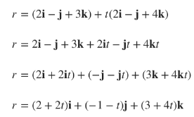
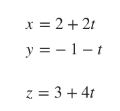
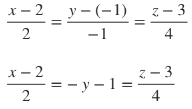
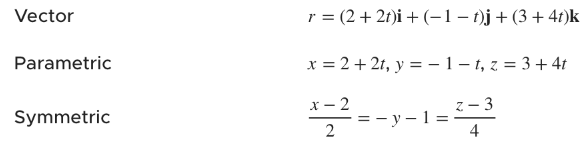

# *Introducion to lines and planes*
---
* In this section we'll look at all diferents ways to represent lines and planes in space. More specifically, we'll investigate vector equations, parametric equations, and symmetric equations, all of which can be used to represent both lines and planes.
* Let's get started by looking at those kinds of equations, but then we'll look at other applications of lines and planes, like how to determine where a line and a plane intersect one another, how to determine the angle between two planes, or how to find the distance between a point and a plane or a line and a plane

# *Vector parametric and symmetric equations of a line*
---
* Vector, parametric, and symmetric equations are different types of equations that can be used to represent the same line. We use different equations at different times to tell us information about the line, so we need to know how to find all three types of equations.
  * The **vector** equation of a line is given by
        $r = r_0 + t*v$
        where $r_0$ is a point on the line and $v$ is a parallel vector
  * The parametric equations of a line are given by
        
    $x = a$

    $y=b$

    $z=c$
            
    where $a$, $b$ and $c$ the coefficients from the vector equation $r = a\textbf{i} + b\textbf{j} + c\textbf{k}$
  * The symmetric equations of a line are given by
  
    $\frac{x-a_1}{v_1}=\frac{y-a_2}{v_2}=\frac{z-a_3}{v_3}$

    where $a(a_1,a_2,a_3)$ are the coordinates from a point on the line and $v_1$, $v_2$ and $v_3$ are the coordinates from a parallel vector

---
**Example**
Find the vector, parametric and symmetric equations of the line that passes through the point $a(2,-1,3)$ and is perpendicular to $2i-j+4k=1$

Before we get started, we can say that the given point $a(2,-1,3)$ can also be represented by $2i-j+3k$. Additionally, we know taht the given vector $2i-j+4k=1$ can be represented by $<2,-1,4>$, or $2i-j+4k$. To summarize what we know, we have

$<2,-1,3> \rightarrow 2i-j+3k$  

$<2,-1,4> \rightarrow 2i-j+4k$
    
To find the vector equation of the line, we'll use $r =e_0 +t*v$, where $r_0$ is the point on the line $2i-j+3k$ and $v$ is the perpendicular vector $2i-j+4k$

With the vector equation of this line in hand, it'll be very easy for us to find the parametric equations of the line, because all we have to do is take the coefficients from the vector equation, and the parametric equations are

To find the symmetric equations, we'll just plug the given coordinate point in for $a_1$, $a_2$ and $a_3$, plus the coefficients from perpendicular vector in for $v_1$, $v_2$, and $v_3$.

In conclusion, we've found the following three equations for the same line:

---

There's one other thing you need to be aware of when you're finding symmetric equations. Sometimes $v_1$, $v_2$ or $v_3$ will be equal to 0. In this case, you pull that particular fraction out of the symmetric equation, put it by itself, and don't divide by 0. So, if the formular for symmetric equations is 

$\frac{x-a_1}{v_1}=\frac{y-a_2}{v_2}=\frac{z-a_3}{v_3}$

and $v_1=0$, then the symmetric equations become

$x-a_1,\frac{y-a_2}{v_2}=\frac{z-a_3}{v_3}$

# *Parallel intersecting skew and perpendicular lines*
---

# *Equation of a plane*
---

# *Intersection of a line and a plane*
---

# *Parallel perpendicular and angle between planes*
---

# *Parametric equations for the line of intersection of two planes*
---

# *Symmetric equations for the line of intersection of two planes*
---

