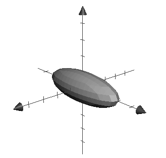
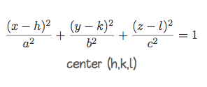
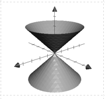

# *Reference chart for cylinders and quadric surfaces*
---
Name | Surface | Standard form | Shifted form | Traces | Axis set by | Tips
--- | --- | --- | --- | --- | --- | ---
Ellipsoid |  | $\frac{x²}{a²} + \frac{y²}{b²} + \frac{z²}{c²} = 1$ *center (0,0,0)* |  | b | c | d | e | f |
Cone |  | 
Cylinder
Elliptic Paraboloid
Hyperbolic Paraboloid
Hyporboloid of one sheet
Hyperboloid of two sheets