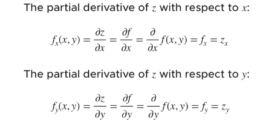
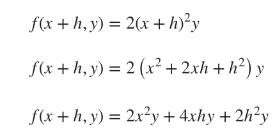
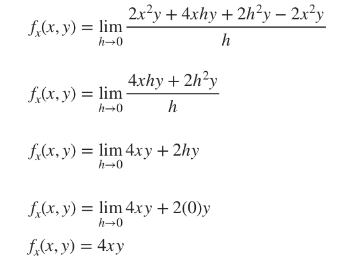
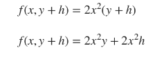
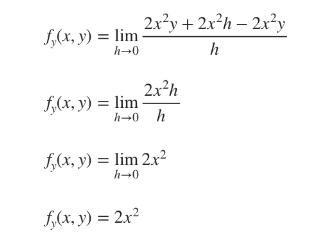
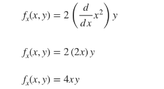
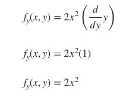

# *Introduction to partial derivatives*
---
In the same way that limits and continuity of multivariable fucnctions can't be tested for in the same way as for single variable functions, we can't find derivatives for multivariable fuctions in the same way we found them for single variable functions.
Single variable functions are defined for $y$ in terms of $x$, so when you differentiate, you simply take the derivative with respect to $x$. But when you have a multivariable function defined for $z$ with respect to $x$ and $y$, you can't simply take the derivative with respect to $x$, or with respect to $y$, and not account for the derivative of the other variable.
So when we differentiate a multivariable function, we'll have to find a way to account for both variables. That's where partial derivatives come in.
In this section we'll look at how to find partial derivatives of a multivariable functions. Let's get started by looking at partial derivatives, and then we'll touch on higher order partial derivatives

# *Partial derivatives in two variables*
---
By this point we've already learned how to find derivatives of single-variable functions. After learning derivative rules like power rule, product rule, quotient rule, chain rule, and others, we're pretty comfortable handling the derivatives of functions like these:

$f(x) = x² + 5$

$f(x) = \frac{(x²+4)³ * \sin{x}}{x⁴+\ln{7x⁴}}$

But now it's time to start talking about derivatives of multivariable functions, such as 

$f(x,y) = x⁴y³ + x³y²+\ln{xe^{y}}$

Finding derivatives of a multivariable function like this one may be less challenging than you think, because we're actually only goind to take the derivative with respect to $x$ while we treat $y$ like it's a constant. Then we'll take another derivative of the original function, this one with respect to $y$, and we'll treat $x$ as a constant.
In that way, we sort of reduce the problem to a single-variable derivative problem, which is a derivative we already know how to handle
We call these kinds of derivative "partial derivative" because we're only taking the derivative of one part (variable) of the function at a time. Remember the definition of the derivative from single-variable calculus (aka the different quotient?) Let's adapt that definition so that it works for us for multivariable functions.
We know that, if $z$ is a function defined in terms of $x$ and $y$, like $z=f(x,y)$, then 
    
The partial derivative of $z$ with respect to $x$ and $y$ is
  
  $$
  z_x= f_x(x,y)= \lim_{h \rightarrow 0} \frac{f(x+h,y) - f(x,y)}{h}
  $$

  $$
  z_y= f_y(x,y)= \lim_{h \rightarrow 0} \frac{f(x, y+h) - f(x,y)}{h}
  $$

The difinition as we've written it here gives two different kinds of notation for the partial derivatives of $z: z_x or z_y$ and $f_x(x,y) or f_y(x,y)$. In fact, there are many ways you might see partial derivatives defined.
* The partial derivatives of a function $z$ defined in terms of $x$ and $y$ could be written in all of these ways:
  
  

Let's use what we've learned so far to work through an example using the difference quotient to find the partial derivatives of a multivarible function.
---
**Example**
Using the definition, find the partial derivatives of $f(x,y)=2x²y$

For the partial derivative of $z$ with respect to $x$, we'll substitute $x+h$ into the original function for $x$

Plugging our values of $f(x,y)$ and $f(x+h, y)$, into the definition, we get

For the partial derivative of $z$ with respect to $y$, we'll substitute $y+h$ into the original function for $y$

Plugging our values of $f(x,y)$ and $f(x, y+h)$, into the definition, we get

You'll remember from single-variable calculus that using the definition of the derivative was the "long way" that we learned to take derivative before we learned the derivative rules that made the process faster. The good news is that we can apply all the same derivative rules to multivariable functions to avoid using the difference quotient. We just have to remeber to work only one variable at a time, treating all other variable as constants. 
The nex example show how the power rule provides a faster way to find this function's partial derivatives
---
**Example**
Using the definition, find the partial derivatives of $f(x,y) = 2x²y$

For the partial derivative of $z$ with respect to $x$, we'll treat $y$ as a constant and use power rule to find the derivative

For the partial derivative of $z$ with respect to $x$, we'll treat $y$ as a constant and use power rule to find the derivative

# *Partial derivatives in three or more variable*
---

# *Higher order partial derivatives*
---