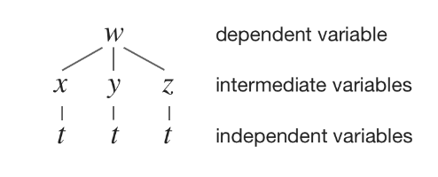
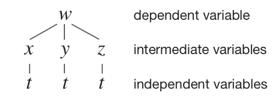

# *Introduction to Chain Rule*
---
We already know how to apply chain rule to the derivative whenever we differentiate a single variable function, and now we're going to look at how to apply chain rule to the partial derivatives whenever we differentiate a multivariable function.

Sometimes this can get a little confusiong, but if we need to, we can always use a tree diagram to help us keep track of how we're applying the chain rule.

In this section we'll look at chain rule for multivariable functions, plus three diagrams. Let's get started with an overview of the chain rule and a couple of examples.
# *Chain rule in multivariable functions*
---
Previously we've been asked to find partial derivatives of multivariable functions, like

$$
f(x,y,z) = xyz
$$

For multivariable function like this one, $f$ is the dependent variable, and $x$, $y$ and $z$ are the independent variables. When we take partial derivatives of a function like rhis one, we need one partial derivative with respect to each of the independent variables. Since there are three independent variables, we'll have three partial derivatives

$$
\frac{\partial f}{\partial x} = yz
$$

$$
\frac{\partial f}{\partial y} = xz
$$

$$
\frac{\partial f}{\partial z} = xy
$$

But now we need to introduce a new type of multivariable function, one in which we insert *intermediate* variables in between the dependent and independent variables. For example, if we defined parametric equations for, x ,y and z from the function above, we might have something like

$$
f(x,y,z)=xyz
$$ 
where

$$
x = t | y=t²| z=t³
$$

In this case, f is the dependent variable, x,y and z are intermediate variables, and the parameter t is the independent variable. Just as before, the number of partial derivatives we'll find for this function depends on the mumber of independent variables. SInce we have just one independent variable, we'll only have one derivative. And since we only have one derivative, it'll be "normal" derivative, instead of a partial derivative. This is called a **Case I function**

Let's look in more detail at what we call **Case I** and **Case II functions**

## *Case I*

A Case I scenario is when have **one independent variable**

More specifically, the function is defined for one dependent variable in terms of multiple intermediate variables, which are all in terms of one independent variable, like this:

Case I always results in only one derivative, which is the derivative of the dependent variable with respect to the independent variable. For the case described in the tree diagram above, the formula for the partial derivative would be

$$
\frac{dw}{dt} = \frac{\partial w}{\partial x} \frac{dx}{dt} + \frac{\partial w}{\partial y} \frac{dy}{dt} + \frac{\partial w}{\partial z} \frac{dz}{dt}
$$

Notice how we multiply the partial derivatives of the dependent variable with respect to the intermediate variables, by the "normal" derivatives of the intermediate variables with respect to the independent variable, and then add those products together

Let's try a Case I example

---
**Example**
Use chain rule to find the partial derivatives of the multivariable function

$w = x²y - 6y³\sqrt{z}$, where

$$
x = 5t² | y=4t+1| z=t³-5t
$$

Since w is defined in terms of x, y and z, and x,y and z are all defined in terms of t, we have the following tree diagram:

The mumber of independent variables dictates the number of derivatives we need to find. In this case, with only have one independent variable, we'll only have one derivative, which will be the derivative of the dependent variable w eith respect to independent variable t

We need to find each component of the formula for $\frac{\partial w}{\partial t}$, and we'll start with the partial derivatives of w with respect to the intermediate variables x, y and z

