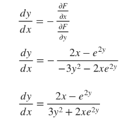
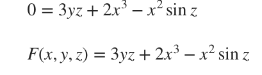
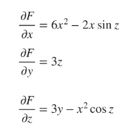
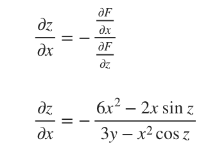
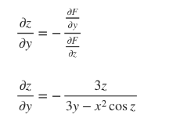

# *Introduction to implicit differentiation*
---
You may remember from Calculus 1 that implicit differentiation is the process we use to differentiate a function when the function is implicitly defined.
With explicitly defined functions, you'll have an equation that's solved for $y$ in terms of $x$. Something like

$y=x²+1$

It's simple to differentiate an explicitly defined function, since we're looking for the derivative of $y$ in terms of $x$. But when a function is implicitly defined, you still need to differentiate $y$ with respect to $x$, but all the $y$'s and $x$'s are mixed up on both sides of the equation.
Something like

$y+ x² = xy²$

In this section we'll look at how use implicit differentiation to find the derivative of an implicitly defined multivariable function. Let's start with some examples of implicit differentiation for multivariable functions.
# *Implicit differentiation for multivariable function*
---
When we want to use implicit differentiation to find partial derivatives of multivariable functions, we'll use the following formulas

*For multivariable functions in two variable:*

$\frac{\partial y}{\partial x} = - \frac{\frac{\partial F}{\partial x}}{\frac{\partial F}{\partial y}}$

*For multivariable functions in three variables:*

$\frac{\partial z}{\partial x} = - \frac{\frac{\partial F}{\partial x}}{\frac{\partial F}{\partial z}}$

and 

$\frac{\partial z}{\partial y} = - \frac{\frac{\partial F}{\partial y}}{\frac{\partial F}{\partial z}}$

Before we can use these formulas to find derivatives or partial derivatives of the original function, we'll need to rearrange it so that it's equal to 0, and then rename it $F(x,y)$ (for two variable functions) or $F(x,y,z)$ (for three variable functions).

Let's try an example with a multivariable function in two variables
---

**Example**
Use implicit differentiation to find the partial derivative of the multivariable function. 

$xe^{2y}=x²-y³$

We'll start by rearranging the function so that it's equal to 0, then we'll call it $F(x,y)$

$0 = x²-y³-xe^{2y}$

$F(x,y) = x²-y³-xe^{2y}$

Now we'll take partial derivatives of $F$ with respect to $x$ and $y$

$$
\frac{\partial F}{\partial x} = 2x - e^{2y}
$$

and

$$
\frac{\partial F}{\partial y} = -3y² - 2xe^{2y}
$$

We'll plug the partial derivatives into the formula for the derivative of a multivariable function with two variables.

This is the partial derivative of $xe^{2y}=x²-y³$

Now we'll try an example with a multivariable function in three variables
---

**Example**
Use implicit differentiation to find the partial derivatives of the multivariable function

$$
x²\sin z = 3yz+2x³
$$

We'll start by rearranging the function so that it's equal to 0, then we'll call it $F(x,y,z)$

Now we'll take partial derivatives of $F$ with respect to $x,y$ and $z$

We'll plug the partial derivatives into the formula for the derivative of a multivariable function with three variables.

and

These are the partial derivatives of the $x²\sin z = 3yz+2x³$