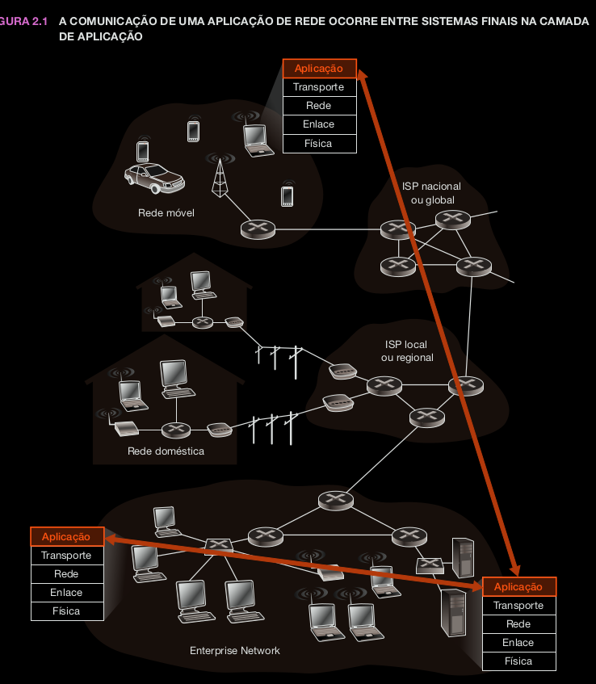
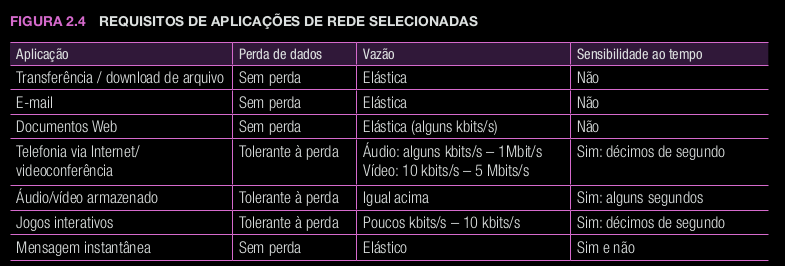
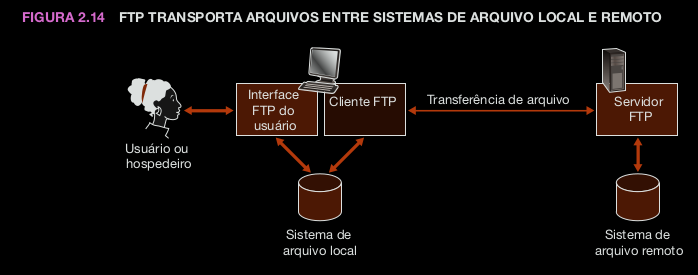
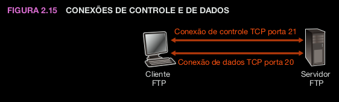

# ***Princípios de Aplicações de Rede***
---
## *Arquiteturas de aplicação de rede*

* **Arquitetura da aplicação**: é projetada pelo programador e determina como a aplicação é organizada nos vários sistemas finais
* Duas arquiteturas mais utilizadas em aplicações modernas de rede: **cliente-servidor** ou **P2P**
* **Arquitetura cliente-servidor**: o hospedeiro está sempre funcionando, denominado *servidor*, que atende as requisições de muitos outros hospedeiros, denominados *clientes*. 
* Os clientes não se comunicam diretamente uns com os outros
* Servidor tem endereço fixo, bem conhecido, denomidado endereço IP
* É comum o uso de datacenter, que acomoda um grande número de hospedeiros para criar um servidor virtual que possa atender diversas requisições de diversos clientes
* os provedores de serviços têm de pagar pelos custos de interconexão recorrente e largura de banda para o envio de dados a partir de seus datacenters.
* **Arquitetura P2P:** 

## *Comunicação entre processos*

* Um processo pode ser descrito como um programa que está rodando dentro de um sistema final.
* Os processos em dois sistemas finais diferentes se comunicam trocando mensagens por meio da rede de computadores. Um processo originador cria e envia mensagens para a rede; um processo destinatário recebe-as e responde, devolvendo outras



### Processos clientes e processos servidores

* Uma aplicação de rede consiste em pares de processos que enviam mensagens uns para os outros por meio de uma rede.
* Para cada par de processos comunicantes, normalmente chamamos um dos processos de cliente e o outro de servidor
* No contexto de uma sessão de comunicação entre um par de processos, aquele que inicia a comunicação (isto é, o primeiro a contatar o outro no início da sessão) é rotulado de cliente. O que espera ser contatado para iniciar a sessão é o servidor.
* Qualquer mensagem enviada de um processo para outro tem de passar pela rede subjacente. Um processo envia mensagens para a rede e recebe mensagens dela através de uma interface de software denominada **socket**.
* **Socket:** Um socket é uma interface de programação utilizada para a comunicação entre processos em uma rede de computadores. Ele fornece um ponto de extremidade para a troca de dados, permitindo que programas em diferentes dispositivos se conectem, enviem e recebam informações. Sockets são essenciais para o desenvolvimento de aplicações que envolvem comunicação em rede, como transferência de arquivos, jogos online e acesso a serviços web.

### A interface entre o processo e a rede de computadores


## *Serviços de transporte disponíveis para aplicações*

## *Serviços de transporte providos pela internet*

* A internet (as redes TCP/IP) disponibiliza dois protocolos de transporte para aplicações: TCP e o UDP
* A figura abaixo mostra os requisitos do serviço para algumas aplicações
  
  

### Serviços do TCP

* Serviço orientado para conexão + serviço confiável de transferência de dados
* **Serviço orientado para conexão:** O TCP faz o cliente e o servidor trocarem informações de controle de camada de transporte antes que as mensagens de camada de aplicação comecem a fluir. Esse procedimento de apresentação, por assim dizer, alerta o cliente e o servidor, permitindo que eles se preparem para uma enxurrada de pacotes. Após a fase de apresentação, dizemos que existe uma conexão TCP entre os sockets dos dois processos. A conexão é full-duplex (simultânea), visto que os dois processos podem enviar mensagens um ao outro pela conexão ao mesmo tempo. Quando termina de enviar mensagens, a aplicação deve interromper a conexão.
* **Serviço confiável de transporte:** Os processos comunicantes podem contar com o TCP para a entrega de todos os dados enviados sem erro e na ordem correta. Quando um lado da aplicação passa uma cadeia de bytes para dentro de um socket, pode contar com o TCP para entregar a mesma cadeia de dados ao socket receptor, sem falta de bytes nem bytes duplicados
* O TCP também inclui um mecanismo de controle de congestionamento

### Serviços do UDP
* O UDP é um protocolo de transporte simplificado, leve, com um modelo de serviço minimalista. É um serviço não orientado para conexão; portanto, não há apresentação antes que os dois processos comecem a se comunicar. O UDP provê um serviço não confiável de transferência de dados — isto é, quando um processo envia uma mensagem para dentro de um socket UDP, o protocolo não oferece garantias de que a mensagem chegará ao processo receptor. Além do mais, mensagens que chegam de fato ao processo receptor podem chegar fora de ordem.
* O UDP não inclui um mecanismo de controle de congestionamento; portanto, um processo originador pode bombear dados para dentro de uma camada abaixo (a de rede) à taxa que quiser.

## *Protocolos de camada de aplicação*

## *Apicações de rede abordadas neste livro*

# *A Web e o HTTP*
---

## *Descrição geral do HTTP*

## *Conexões persistentes e não persistentes*

## *Formato da mensagem HTTP*

## *Interação usuário-servidor: cookies*

## *Caches Web*

## *GET condicional*

# *Transferência de arquivos FTP*
---
* ***FTP***: File Transfer Protocol
* Em uma sessão típica FTP, o usuário quer transferir arquivos entre um hospedeiro local e um servidor remoto. Para acessar a conta remota, o usuário fornece uma identificação e uma senha, que após autorizado pelo servidor, pode fazer a transferência (download ou upload)



* Como mostra a imagem, o usuário interage com o FTP através de um agente de usuário FTP. Primeio, ele fornece o nome do hospedeiro remoto, que faz com que o processo cliente FTP do hospedeiro local estabeleça uma conexão TCP com o processo servidor FTP do hospedeiro remoto. O usuário então fornece sua identificação e senha, que são  enviadas pela conexão TCP como parte dos comandos FTP. Assim que autorizado pelo servidor, o usuário copia um ou mais arquivos armazenados no sistema de arquivo local para o sistema de arquivo remoto (ou vice-versa).
* Tanto o HTTP quanto o FTP utilizam o TCP
* FTP usa duas conexões paralelas TCP (ao contrário do HTTP, que utiliza apenas 1): uma **conexão de controle** e uma **conexão de dados**
* **Conexão de controle**: envia informações de controle (identificação, senha, comandos de troca de diretório, comados de *put* e *get*)
* **Conexão de dados**: é a que de fato envia os arquivos
  


* Como o FTP usa uma conexão de controle separada, dizemos que ele envia suas informações de controle **fora da banda**.
* Quando é iniciada uma sessão FTP, o lado do usuário inicia uma conexão TCP de **controle** com o lado do servidor na porta número 21 e envia por ela os comandos
* Quando o lado do servidor recebe um comando *put* ou *get*, o servidor abre uma conexão de **dados** para o lado do cliente na porta 20 para transferir os arquivos. O FTP envia exatamente 1 arquivo pela conexão e logo em seguida o fecha.
* Logo, com o FTP, a conexão de controle fica aberta durante toda a sessão do usuário, mas a de dados é criada e fechada para cada arquivo transferido na sessão
* Durante a sessão, o FTP deve manter informações de estado sobre o usuário (diretório corrente, conta do usuário, ...), o que limita o número de sessões simultâneas

## *Comandos e respostas FTP*

```bash 
USER username
#usado para enviar identificação do usuário ao servidor
PASS password
#usado para enviar a senha do usuário ao servidor
LIST
#usado para pedir ao servidor que envie uma lista com todos os arquivos existentes no atual diretório remoto. A lista de arquivos é enviada por meio de uma conexão de dados (nova e não persistente),e não pela conexão TCP de controle.
RETR filename
#usado para extrair (isto é, obter) um arquivo do diretório atual do hospedeiro remoto. Ativa o hospedeiro remoto para que abra uma conexão de dados e envia o arquivo requisitado por essa conexão.
STOR filename
#usado para armazenar (isto é, inserir) um arquivo no diretório atual do hospedeiro remoto.
```

* Há, em particular, uma correspondência direta entre o comando que o usuário gera e o comando FTP enviado pela conexão de controle. Cada comando é seguido de uma resposta, que é enviada do servidor ao cliente.
* As respostas são números de três dígitos com uma mensagem opcional após o número. Elas se assemelham, em estrutura, ao código de estado e à frase da linha de estado da mensagem de resposta HTTP.
  
Exemplo:   
`331 Nome de usuário OK, senha requisitada`

# *Correio eletrônico na Internet*
---

## *SMTP*

## *Comparação com o HTTP*

## *Formatos de mensagem de correio*

## *Protocolos de acesso ao correio*

# *DNS: o serviço de diretório da Internet*
---

## *Serviços fornecidos pelo DNS*

## *Visão geral do modo de funcionamento do DNS*

## *Registros e mensagens DNS*

# *Aplicações P2P*
---

## *Distribuição de arquivos P2P*

## *Distributed Hash Tables (DHTs)*

# *Programação de sockets*
---

## *Programação de sockets com UDP*

## *Programação de sockets com TCP*

# *Resumo*
---
