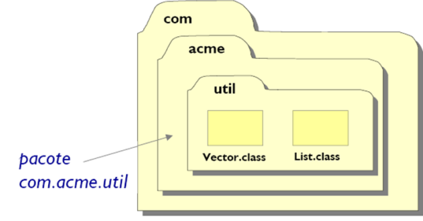
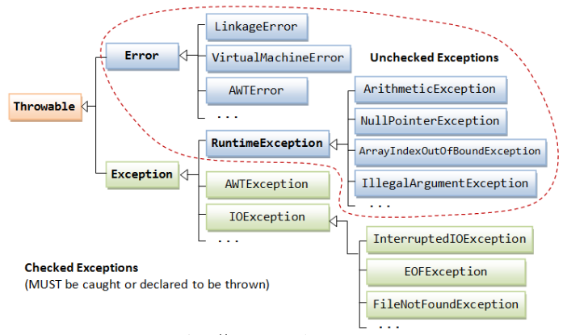
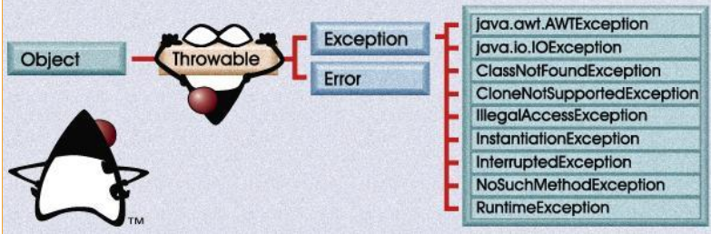

# *Pacotes Java*
---

## *O conceito de pacotes*
* Um pacote é: um conjunto de classes e interfaces relacionadas e outros pacotes que provê **acesso protegido** e **gerenciamento de espaço de nomes (namespaces)**


## *Acesso Protegido*
* Os pacotes são organizados em diretórios
* Há um mecanismo de controle de acesso (package) às classes e interfaces de um determinado pacote
* Somente as classes e interfaces de um mesmo pacote podem acessar uns aos outros de forma irrestrita, porém restrigindo o acesso a outros tipos de pacotes

## *Gerenciamento de Espaço de Nomes*
* Para que os nomes de seus tipos não entrem em conflito com os nomes de tipos de outros pacotes, cada qual cria o seu prório espaço de nomes (namespaces)
  
`java.lang.Object e org.omg.CORRA.Object`


* O Java 8 define mais de 200 pacotes para serem utilizados no desenvolvimento de aplicativos Java

### *Principais pacotes Java*
```java
java.lang: //classes e interfaces fundamentais – importado automaticamente
java.applet: //classes e interfaces para a criação de applets na Internet
java.util: //classes e interfaces utilitárias
java.io: //classes e interfaces para entrada e saída
java.nio: //classes e interfaces para buffers
java.net: //classes e interfaces para uso em rede (TCP/IP)
java.rmi: //classes e interfaces para acesso remoto
java.sql: //classes e interfaces para acesso ao Banco de Dados
java.awt: //interface gráfica universal nativa
java.text: //internacionalização, transformação e formatação de texto
java.time: //classes para datas e calendários
javax.crypto: //classes e interfaces para operações de criptografia
javax.xml: //classes e interfaces para manipulação de XML
```
* O nome dos pacotes são hierárquicos e separados por pontos
* Convecionalmente, os elementos dos nomes de pacotes estão normalmente em letras minúsculas
* Para indicar que as classes de um arquivo pertencem a um determinado pacote, utiliza-se a palavra reservada **package**
* A declaração de pacote, se houver, deve estar sempre no inicío do arquivo de origem
* Hierarquias de pacotes são construídas através de hierarquias de diretório
* Para se criar uma classe como pertencente a um pacote, deve-se:
  * Declará-la em um arquivo dentro do diretório que representa o pacote
  * Declarar, na primeira linha, que a classe pertence ao pacote, usando-se a palavra reservada

# *Importação de Pacotes Java*
---
* Para se usar uma classe/interface que está dentro de um pacote, precisa-se referenciar o nome completo desse pacote no acesso à classe:
  `com.hobnob.graphics.Triangulo objeto = new com.hobnob.graphics.Triangulo();`
* Pode-se usar o comando **import** para simplificar a chamada à classe Triangulo
  ```java
  import com.hobnob.graphics.Triangulo; 
  Triangulo objeto = new Triangulo();
  ```
* É possível importar as classes/interfaces de um pacote inteiro:
  `import com.hobnob.graphics.*;`
* Com o coringa "*" é possível importar todas as classes/interfaces que estão definidas em um pacote, **exceto os seus subpacotes**
* Importar todas as classes de um pacote não implica em perda de performance em tempo de execução. Contudo, importar de um em um é considerada uma boa prática, pois facilita a leitura do código para os outros desenvolvedores

# *Controle de Acesso*
---
* Um membro de pacote só pode ser acessado por classes/interfaces declaradas no mesmo pacote
* Quando o modificador de acesso é omitido, diz-se que o membro (atributos/métodos) é do tipo **package**
* Todas as classes do mesmo pacote têm acesso aos atributos e métodos umas das outras

## *Resumo de Visibilidade*
**Visibilidade** | **public** | **protected** | **package (default)** | **private**
--- | --- | --- | --- | ---
Classe | Sim | Sim | Não | Sim
SubClasse | Sim | Sim | Não | Não
Pacote | Sim | Sim | Sim | Não
Geral | Sim | Não | Não | Não

# *Exercícios 1*
---
1. Criar a hierarquia de classes abaixo pertencentes ao pacote
br.abctreinamentos.rh


<details>
<summary>Resposta</summary>

```java
package br.abctreinamentos.rh;
```
</details>

# *Erros e Exceções*
---
* São dois os principais tipos de erros que podem ocorrer no desenvolvimento de software em Java:
  
  * Erros de Compilação
  * Erros em Tempo de Execução


* Erros de Compilação
  
    * Problemas de sintaxe no código-fonte

* Erros em Tempo de Execução
    
  * Problemas na lógica de programação
  * Problemas no ambiente de execução

* O Java define uma classe **Exception** utilizada para representar uma situação inesperada na aplicação, isto é, um **Erro em Tempo de Execução**



* *Unchecked Exceptions (UE)* são o grupo de Exceções que não obrigam o programador a fazer o tratamento prévio delas com uso de **try/catch** ou **throws**.
* *Checked Exceptions (CE)* são o grupo de Exceções que obrigam o programador a fazer o tratamento prévio delas com uso de **try/catch** ou **throws**
* Exceções comuns:
  
  * Divisão por zero (*ArithmeticException*) (UE)
  * Acesso a objeto não instanciado (*NullPointerException*) (UE)
  * Acesso a um índice inválido de array (*ArrayIndexOutOfBoundsException*)(UE)
  * Erro de acesso a dispositivo de E/S (*IOException*) (CE)

* O Java define uma classe **Error** que define as condições consideradas muito graves (tais como problemas na máquina virtual), que tem pouca posibilidade de serem recuperadas



* A classe **Throwable** é a superclasse de **Error** e **Exception**
* A superclasse **Exception** define as subclasses que tratam **Erros em Tempo de Execução**

## *Tratamento de Exceções*

* Os Erros em Tempo de Execução do tipo CE devem ser obrigatoriamente tratados em uma aplicação Java
* São duas as soluções utilizadas:

  * Tratar a Exceção com blocos **try,catch e finally**
  * Declarar a Exceção com a palavra **throws**

* **Tratar a Exceção com os blobos *try,catch e finally***
 ```java
 try {
  //instruções: executa até a linha onde ocorrer exxceção
 } catch (TipoExcecao1 ex) {
  //executa somente se ocorrer TipoExecao1
 } catch (TipoExcecao2 ex) {
  //executa somente se ocorrer TipoExecao2
 } finally {
  // executa sempre
 }
 // executa se exceção for capturada ou se não ocorrer
 ```
 ### *Exercícios*
 1. Dada a classe Teste abaixo, incluir o tratamento de Exceção adequado.
```java
  class Teste {
    public static void (String args[]) {
      int i=0;
      String frases[] = {"um", "dois", "três"};
      while (i<4) {
        //o índice vai de 0 a 2!
        System.out.println(frases[i]);
        i++;
      }
    }
  }
```
<details>
<summary>Resposta</summary>

```java

```
</details>

2. Dada a classe TesteLeitura abaixo, incluir o tratamento de Exceção adequado.
 ```java
import java.io.*;
public class TesteLeitura {
  public static void main(String[] args) {
    byte [] bytes = new byte[10];
    System.out.print("Digite algo: ");
    System.in.read(bytes);
    System.out.println("\nEco: " + new String(bytes));
  }
}
 ```
 <details>
<summary>Resposta</summary>

```java

```
</details>

* **Multicatch**
 ```java
 try {
// código
} catch (Exceção 1| Exceção 2|...| Exceção n) {
// tratamento da exceção
} finally {
//
}
 ```
 * O Multicatch é útil quando se deseja evitar código repetido
 * O **finally** é muito útil quando se trabalha com acesso a Banco de Dados ou manipulação de arquivos, pois é necessário que a aplicação libere os recursos alocados após o seu uso
 * A partir do Java 7, é possível fazer uso do **Gerenciador Automático de Recursos**

  ### **Gerenciamento automático de Recursos**
* O uso do **finally** é muito comum quando se trabalha com acesso a banco de dados, manipulação de arquivos, entre outras situaçoes. São em casos como esses que é necessário que o programa adquira recursos do SO quando necessário e os libere posteriormente
* Para tirar esse trabalho do desenvolvedor, a partir do Java 7 há o gerenciamento automático de recursos
 ```java
public static void main(String[] args) throws Exception {
  try(MyBufferedReader br = new MyBufferedReader(new FileReader("classes.txt"))) {
    String line;
      while ((line = br.readLine()) != null)
      instantiate(line);
  }
 ```
 * Com a mudança, a declaração e a inicialização do **MyBufferedReader** são feitas no prórpio **try**. Isso determina que a instância terá seu método **close()** chamado automaticamente, de forma semelhante àquela obtida quando usamos o **finally**. Isso certamente evita confusões e erros no momento de liberar recursos
 * Em decorrência da chamada implícita do **close()**, esse **try** deve fazer parte de outro **try** contendo um **catch** para **Exception**; ou então o método deve lançar **Exception**.

### *Exercício*
Dada a classe TesteExcecao abaixo, tratar as exceções com uma única instrução catch.
```java
import java.io.*;
public class TesteExcecao {
  public static void main(String args[]) {
    int i = 50;
    i = i / 0;
    System.out.println("O resultado " + i);
    Object c = null;
    System.out.println("O resultado " + c.toString());
  }
}
```
# *Throws e Throw*
---
